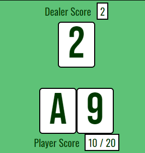
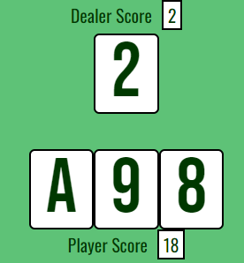
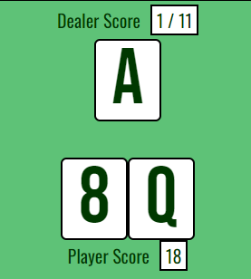
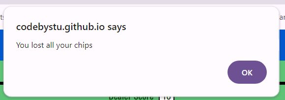
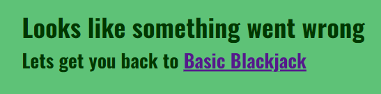

# Basic Blackjack
This is an interactive front end website using HTML CSS and Javascript, it is a basic blackjack game simulator where a single player takes on a computer controlled dealer and tries to increase their bankroll by betting on the outcome of the hand and deciding whether to stand on their current hand or hit and take an additional card in an attempt to be closer to a score of 21, without going over.
The live site can be found [here](https://codebystu.github.io/basic-blackjack/)

## UX

### Colour Scheme
The starting point for the colour scheme choice was the green beize type color, reminiscent of a card table in a casino, i selected this from the colour picker on [color space](https://mycolor.space/) and fed that colour through the pallette generator on the same site, then chose the switch pallette from the suggestions and used the blue for the header, footer and rules overlay.  For maximum contrast all text is in either black or white. .

### Typography

I used [Google Fonts](https://fonts.google.com/) to select "Oswald" as the main font, this was an homage to my grandfather who taught me to play blackjack when I was a kid. For the card faces I wanted something similar but chunkier in appearance and settled on Bebas Neue, I also used this font to create the favicon.

### User Stories
1.  First time visitors and users who don't know how to play blackjack, will want to be informed of the rules and how to play, they may wish to refer back to the rules during gameplay to check on something they have forgotten or do not understand
2.   Users will want to be able to start a new game, with all parameters reset to the initial state of gameplay at any time.
3.   Users will want to see a prompt message at key points in the development of a round, so that they know either what they need to do, or what the resulting outcome of gameplay is.
4.   Users will need to be able to see their current bankroll number to assess the level of stake they can afford, they will want to be able to see their current level of stake and to be able to increase and decrease their stake as they wish.
5.   Users will need to be able to initiate the dealing of the cards once they are happy with their level of stake.
6.   If the user fails to select a stake or tries to stake more than they have in their bankroll, they need to be informed of the error, so they can change their course of action.
7.   During the card dealing phase the user will want to see the cards revealed one at a time as this adds anticipation and excitement to the game,
8.   The user will want to see a numerical display of their score, which accounts for the value of non numerical cards (J,Q,K,A) and will need to see the variable score with the A representing a value of either 1 or 11, this will aid in the decision of whether or not to "hit" and take an extra card.
9.   Users will want to choose the point at which they end their turn.
10.   During the dealers turn phase of the game users will want to see the cards play out one at a time and the dealers score to increment accordingly.
11.   At the point where the dealer hand reaches its end the user will want to receive messaging as to the outcome of the hand, whether they have won or lost and also the amount they have won or lost.
12.   At the end of the hand users will expect their bankroll to be updated if they have won and prompted to play another hand.
13.   If the user misses the final win/push/lose messaging for any reason (such as if they are playing whilst doing something else) thay may still wish to know if they won or lost the previous hand.
14.   When the player has no funds left in their bankroll, they will need to receive a message that they have lost all their money.
15.   As the creator of the site, I want to be able to play blackjack without annoying adverts intruding on gameplay which you get on all commercially available apps.
    

### Original wireframe design
The simple gameplay area is small enough that it will not require any change for smaller screens apart from text size.

## Features
### Existing Features
- Header
    - The header bar features the logo on the left hand side and the How To Play button on the right. When the logo is clicked this reloads the page. when the user hovers over the how to play button, the background turns white amd the text turns black to alert the user that it is a clickable button. On clicking the button, the rules of the game are displayed to inform the user how to play. 

- Rules overlay
    - The rules overlay is displayed at the discretion of the user, it can be accessed at any time and does not effect gameplay.  It describes the objective of the game and what the user must do to play through the different phases of the game.
    At the end of the text is the close button. When the user hovers over it the button reacts in the same way as the How To Play button in the header for consistency and usability. When clicked, it closes the rules overlay so the user can continue on their gameplay.

- Gameboard
    - The gameboard is the main part of index.html and is visible upon loading the webpage. It shows the features which are always visible, Dealer Score, Player Score, Current Stake amount (this isn't labelled and simply shows 0), Bankroll and the New Game button.
    It also shows 2 cards below the dealer score and 2 above the player score, both hands of cards show a 10 and an Ace which represents a score of Blackjack (21 in 2 cards). Showing this layout upon load makes the page quite intuitive.  Anyone who has played blackjack online or at a live table will recognise this layout and understand what the sections represent.  The only clickable button in the game area at this phase is the New Game button at the bottom. When the user hovers over it turns blue to highlight that it is clickable.  Upon clicking the user is taken to the staking phase of the game.

- Staking game phase
    - After pressing the new game button the cards from the previous hand are cleared from the table, a message is displayed beneath PLayer Score, prompting the user to "Place your bet" the 3 stake selection buttons appear beneath the stake-box and the bankroll is credited with an initial amount of 20. The buttons all highlight in blue when the user hovers over them, + and - will increment the stake up and down by 1 at a time on each click and have the inverse effect on bankroll i.e stake increases by 1 and bankroll decreases by 1.  If the user has selected a stake and clicks on the Deal button they will be taken to the initial deal phase of the game.

- Player warning alerts
    - There are two alerts in the staking phase which are triggered if the user tries to do something which prevents them from moving through the game.  If the user tries to reduce stake below 1 or clicks deal without selecting a stake, the minimum stake alert is shown.  If the user tries to increase their stake to a higher amount than their bankroll, the bankroll too low alert is triggered.

- Initial deal screen
    - Once a Deal click has been validated the staking buttons disappear, two cards are dealt to the player and one to the dealer.  The dealer and player score values are calculated and displayed in the corresponding areas on the screen, and the player buttons Hit and Stand are displayed where the staking buttons used to be.  The buttons highlight blue when hovered, in keeping with all the gameplay buttons. clicking Hit will add another card to the player hand, the player can hit as many times as they like until they go over a score of 21, which will automatically end the hand and they will lose their stake.

-   Handling Aces
    - The Ace card has an interchangable value of 1 or 11, unless a value of 11 will result in a hand value over 21, in which case it only has a value of 1. When a player has an ace and the value is interchangable they are shown both potential scores i.e. 7 / 17. This reverts to a single score when a value of 11 would result in the hand going bust.  For the dealer an ace will only show an interchangable value between 1 and 16 as any score between 17 and 21 automatically ends the dealer turn and the result is calculated.

- Automated Gameplay
    - In this video you can see a single hand being played. Note how the cards are dealt one at a time to add that sense of anticipation to the game, and the messaging that appears temporarily below Player Score to inform the player of the outcome of the hand.  There are a number of messages which display in this area depending on how the cards play out.  They are "Blackjack" when player gets blackjack, "Dealer blackjack" when dealer gets blackjack. "Bust" and "Dealer Bust" when either player or dealer goes over 21. When the end result is calcualted the message box will display either "you win" with amount won "you lost" with amount lost or "Push, stake rerturned" in the event of a draw. if the user won or if it was a draw the bankroll is increased accordingly after this message.  After a short delay the game cycles back to the new hand phase, the cards are cleared from the table, the "place your bet" prompt displays and the staking buttons reappear

https://github.com/user-attachments/assets/606d7e39-f08d-4086-b4ec-5b8b30bc827d

- After hand information
    - When the game cycles round and automatically starts the next hand the Dealer and Player scores from the previous hand are retained until the player has set stake and clicked Deal.  The reason for this is that in the busy world we live in people often play minigames like this whilst doing something else.  The end game messaging is only displayed for a couple of seconds and would be quite easy to miss if you are distracted for a brief moment. In the below example the player would know that they lost the previous hand.

- End game
    -   When the player loses all of their bankroll the game ends at the end of that hand and the "You lost all your chips" alert is displayed. On clearing the alert, the only button available to the user is "New Game"

- Footer
    - The page footer contains a link to the site owners github page, it opens in a new window and allows the user to see more of the site owners work

- Custom 404 page
    - This feature gives an error message on a page styled in the theme of the rest of the site, with a link to get the user back to the main landing page. Useful to users who follow a broken link or if they encounter some other error, they can get back to the main site easily.

### Features Left To Implement
-   Future features
    - Users may like the ability to increment their stake by more than 1 at a time, chip buttons with values of 1,2 5, and 10 are common in similar games.
    - users may wish to bet all of their bankroll at a single click, an "All In"
     button could be created for this.
     - Card suits and colours could be added, allowing for side bets also, but then it would no longer be 'Basic' blackjack.
 
## Tools and Technologies Used
- [Balsamiq](https://balsamiq.com/) used for wireframe
- [Git](https://git-scm.com/) for version control
- [Github](https://github.com/) for repository and page deployment
- [VScode](https://code.visualstudio.com/) my IDE of choice
- HTML language used to place the content
- CSS  language used to style the content
- Javascript language used to enable interactivity and logical operators.
- Markdown  language used to create the README.md and TESTING.md files
- [Favicon.io](https://favicon.io/favicon-generator/) to create the J favicon
- [Google Fonts](https://fonts.google.com/) for font pairings and importing to project
- [Google Devtools](https://developer.chrome.com/docs/devtools) for testing and development
- [W3C](https://validator.w3.org/) for html validation
- [W3C Jigsaw](https://jigsaw.w3.org/css-validator/) for CSS validation
- [JSLint](https://www.jslint.com/) for javascript validation
- [Esprima](https://esprima.org/demo/validate.html) for javascript validation
## Testing
Testing was carried out throughout the development of the site, all visual components and layout design were viewed on a variety of screen sizes before during and after styling using Google Dev Tools in the Chrome browser, and following the completion of each page further testing was carried out on Firefox and Edge on my laptop and Safari on an iphone 11, iphone 6s and ipad air 2, both for a visual check of layout and to test all feature and link functionality.
Javascript functions were tested using JSHint, step through with [Python tutor](https://pythontutor.com/javascript.html#mode=edit) and heavy use of console log to visualise what data was resulting as code was developed. Final Javasript syntax checking with Esprima.
## User Satisfaction
-   User Story fulfilment
    1. The rules and instructions on how to play are accessible by clicking the "How to play" button. They can be refered to during gameplay without having to exit the game.
    2. Users can start a new game at any time by pressing the "New Game" button. This resets all parameters back to the initial game state.
    3. Users are prompted to take action and informed of outcomes through the "message-box" div in the HTML file. With Javascript updating the messaging accordingly at different phases of the game.
    4. Users can see their current bankroll value at the bottom of the playing area, this is always visible and updates accordingly at the end of a hand and during staking. Similarly the users current stake level is always in view, and resets to 0 at the end of each hand.
    5. There is no time limit to the staking phase of the game, the user has to initiate the next phase of the game by clicking "Deal"
    6.  Alerts are used to inform the user if they try to make an action which is against the rules i.e. deal without staking, or staking more than they have in their bankroll
    7.  During the initial deal cards appear one at a time alternately between player and dealer
    8.  The value of player and dealer hands are clearly displayed in the corresponding named areas on the gameboard.
    9.  There is no time limit to the user choosing whether to "Hit" for an extra card or "Stand" on their current value. The next phase of the game only initiates when the user clicks "Stand"
    10. The automated dealers hand phase of the game plays out one card at a time adding excitement and anticipation.
    11. The "message-box" div informs the user of the outcome of the hand and the amount won, lost, or returned in the event of a tie.
    12. The user bankroll is updated with winnings or returned stake after the hand outcome messaging.
    13. Hand values remain visible after the messaging is complete so that users who miss the messaging will still be able to see the result of the previous hand
    14. An alert message informs the user when they lose their final chips and have no bankroll left
    15. The site is ad free
    
## Manual Testing
### Feature Tests
| Feature | Action | Expected Result | Actual Result |
| --- | --- | --- | --- |
| Logo | Click Logo | Load / refresh Home page | Home page loaded / refreshed |
| How to play button | Hover over button | colours invert | colours invert |
| How to play button | click | Rules are displayed | rules are displayed |
| Close rules button | Hover over button | colours invert | colours invert |
| Close rules button | click | Rules are hidden | rules are hidden |
| New Game button | Hover over button | button turns blue | button turns blue |
| New Game Button | click | Bankroll set to 20, cards cleared from table and staking buttons visible | Bankroll set to 20, cards cleared from table and staking buttons visible |
| + button | hover over button | button turns blue | button turns blue |
| - button | hover over button | button turns blue | button turns blue |
| Deal button | hover over button | button turns blue | button turns blue |
| + button | click | stake increases by one and bankroll decreases by one | stake increases by one and bankroll decreases by one |
| - button | click | stake decreases by one and bankroll increases by one | stake decreases by one and bankroll increases by one |
| Deal button | click | staking buttons disappear, 3 cards are dealt, hit and stand buttons appear | staking buttons disappear, 3 cards are dealt, hit and stand buttons appear |
| hit and stand buttons | hover over button | button turns blue | button turns blue |
| Hit button | click | Adds player card and increments score | Adds player card and increments score |
| Stand button | click | removes hit and stand buttons and plays dealer hand | removes hit and stand buttons and plays dealer hand |
| Alerts | when alert is triggered through gameplay | appropriate alert is displayed | appropriate alert is displayed |
| Codebystu link in footer | click | opens new window and loads codebystu github page | opens new window and loads codebystu github page |
### Visual Tests
#### Screen Size Responsive Elements
| Feature | Action | Expected Result | Actual Result |
| --- | --- | --- | --- |
| Text in rules section | when opening on mobile | text size reduced to fit on screen | text size reduced to fit on screen |
| Card graphic on screen |  when opening on mobile | size reduced to fit on screen | size reduced to fit on screen |

## Automated Testing
### Accessibility
[WAVE](https://wave.webaim.org/report#/https://codebystu.github.io/basic-blackjack/) found no accessibility issues on the site
### Lighthouse Performance
- Desktop performance score was 100% across the board for the main game page.  The 404 page scored only 80% for SEO due to a missing meta description and the link back to the home page was not descriptive. Afetr updating both of these issues it scores 100% across the board.

- Mobile performance scores 99% and 100% for the other three areas
### W3Validator HTML
-   No issues were found

### Jigsaw Validator CSS
- No isues were found

### JSLint
-   The linter threw up warnings where I used "let" instead of "var" to declare some variables, but I wanted these variables to only be accessible within their respective codeblocks, so these warnings were ignored.
-   The linter took exception to using '' instead of "", these warnings were ignored as did not effect syntax.
-   The linter was unable to complete its operation on the clearCards function, I assume that this is due to it running a for loop across an element on the DOM which the linter does not have access to, the function itself works as intended.

### Esprima
- Showed all Javascript syntax to be good with no warnings or errors

## Bugs

There are no known bugs remaining within the site
| Bug | Cause | Fix Applied | Fix Succesful? |
| --- | --- | --- | --- |
| Stake incrementing by 2 on second hand and by 3 on third hand etc | Bubbling? | stopPropagation | No |
| Stake incrementing by 2 on second hand and by 3 on third hand etc | Event listener error | dont use for loop to add event listener | yes |
| Incorrect hand result when player has an ace | value in player score box is a string containing two numbers '7 / 17' | set value to sum only when player clicks "stand" | yes |
| Incorrect handling of blackjack in playerCard | blackjack only relevant on second card | create secondCard function to handle blackjack event | yes |

## Interesting Findings
The bug which manifested in stake doubling then trebling etc also affected the number of cards being dealt on the initial deal.  I had initially used a for loop copied from the Love Math project to add the event listeners to the player buttons. 
Whilst trying to find the solution I was being directed to articles on bubbling as my question to google was along the lines of "function being called multiple times" after trying the solution suggested in multiple articles (use stopPropagation) and not finding a solution, I tried switching my question on google search to query the event listener instead of the function. Key Learning - rephrase your question focussing on a diferent element.
One article suggested removing the event listener and then reapplying it, as each time the function including the event listener was called it added another on top, so I had multiple event listeners all being called at once, this was confirmed by console logging the output of the buttons.  I was unable to get this to work, but the article used a line of code to add each event listener instead of a for loop.
I switched my code from a for loop to individual lines for each button and this solved the bug without the need to remove the event listners at all.
Further reading has enlightened me that the for loop was indeed layering up multiple event listeners each time the function was called. A for loop should only be used to add event listeners if the elements are created dynamically with javascript. My elements are always there, they are just hidden / revealed by javascript changing the CSS style display to none / block.

## Deployment

- The site was deployed to GitHub pages. The steps to deploy this static html site were: 
  - In the GitHub repository, navigate to the Settings tab 
  - From the code and automation menu on the left hand column select Pages
  - From the source drop down menu select "Deploy from a branch"
  - under the branch heading the first drop down menu select "main"
  - the second drop down menu lets you choose the folder, in this instance select /(root) and then hit Save
  - wait for a moment and a message will be displayed at the top of the page stating "GitHub Pages source saved
  - Reload the page and you will see a message at the top which includes the link to your live site, in this instance it is https://github.com/codebystu/basic-blackjack 
 
## Credits
### Font
-   Beba Neue Font
    - used for the card face and the favicon
    - Font Author: Copyright 2019 The Bebas Neue Project Authors (https://github.com/dharmatype/Bebas-Neue)
- Font Source: https://fonts.gstatic.com/s/bebasneue/v14/JTUSjIg69CK48gW7PXooxW5rygbi49c.ttf
- Font License: SIL Open Font License, 1.1 (http://scripts.sil.org/OFL)

### Code
- [geeks for geeks](https://www.geeksforgeeks.org/how-to-delay-a-javascript-function-call-using-javascript/) article used to create illusion of card dealing animation, add anticipation and allow time to read in-game messaging.
- [Stack Overflow](https://stackoverflow.com/questions/67691159/addeventlistenerclick-function-once-true-firing-multiple-times-in-the) this thread helped me solve the bug with stake doubling and cards being dealt multiple times which I initially thought was bubbling.
- [Medium](https://javascript.plainenglish.io/how-to-remove-html-elements-by-class-name-b0288988dd55) code for removing cards from the table at the end of the hand.
- [W3schools](https://www.w3schools.com/jsref/jsref_reduce.asp) sum value of the player and dealer card array using reduce.

#### Acknowledgements
- All in the UCP-15 tutor group for making it an enjoyable experience so far and being a soundboard
- Sheryl Goldberg my mentor, your positivity, encouragement and feedback have pulled me through the lowest of days with imposter syndrome
