# Basic Blackjack
This is an interactive front end website using HTML CSS and Javascript, it is a basic blackjack game simulator where a single player takes on a computer controlled dealer and tries to increase their bankroll by betting on the outcome of the hand and deciding whether to stand on their current hand or hit and take an additional card in an attempt to be closer to a score of 21, without going over.
The live site can be found [here](https://codebystu.github.io/basic-blackjack/)

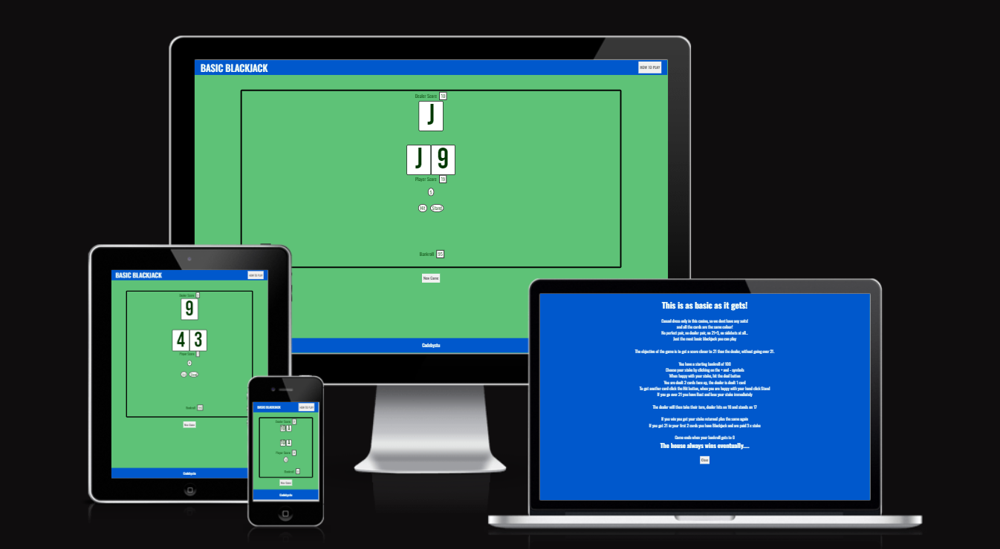
## UX

### Colour Scheme
The starting point for the colour scheme choice was the green beize type color, reminiscent of a card table in a casino, i selected this from the colour picker on [color space](https://mycolor.space/) and fed that colour through the pallette generator on the same site, then chose the switch pallette from the suggestions and used the blue for the header, footer and rules overlay.  For maximum contrast all text is in either black or white. 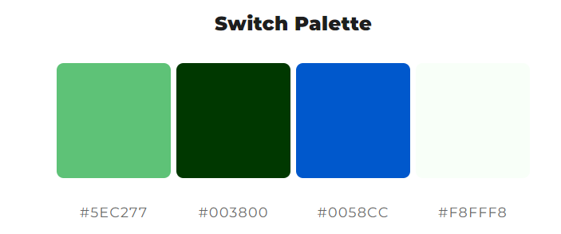.

### Typography

I used [Google Fonts](https://fonts.google.com/) to select "Oswald" as the main font, this was an homage to my grandfather who taught me to play blackjack when I was a kid. For the card faces I wanted something similar but chunkier in appearance and settled on Bebas Neue, I also used this font to create the favicon.

### User Stories
-   First time visitors and users who don't know how to play blackjack, will want to be informed of the rules and how to play, they may wish to refer back to the rules during gameplay to check on something they have forgotten or do not understand
-   Users will want to be able to start a new game, with all parameters reset to the initial state of gameplay at any time.
-   Users will want to see a propmt message at key points in the development of a round, so that they know either what they need to do, or what the resulting outcome of gameplay is.
-   Users will need to be able to see their current bankroll number to assess the level of stake they can afford, they will want to be able to see their current level of stake and to be able to increase and decrease their stake as they wish.
-   Users will need to be able to initiate the dealing of the cards once they are happy with their level of stake.
-   If the user fails to select a stake or tries to stake more than they have in their bankroll, they need to be informed of the error, so they can change their course of action.
-   During the card dealing phase the user will want to see the cards revealed one at a time as this adds anticipation and excitement to the game,
-   The user will want to see a numerical display of their score, which accounts for the value of non numerical cards (J,Q,K,A) and will need to see the variable score with the A representing a value of either 1 or 11, this will aid in the decision of whether or not to "hit" and take an extra card.
-   Users will want to choose the point at which they end theior turn.
-   During the dealers turn phase of the game users will want to see the cards play out one at a time and the dealers score to increment accordingly.
-   At the point where the dealer hand reaches its end the user will want to receive messaging as to the outcome of the hand, whether they have won or lost and also the amount they have won or lost.
-   At the end of the hand users will expect their bankroll to be updated if they have won and prompted to play another hand.
-   If the user misses the final win/push/lose messaging for any reason (such as if they are playing whilst doing something else) thay may still wish to know if they won or lost the previous hand.
-   When the player has no funds left in their bankroll, they will need to receive a message that they have lost all their money.
-   As the creator of the site, I want to be able to play blackjack without annoying adverts intruding on gameplay which you get on all commercially available apps.
    

### Original wireframe design
The simple gameplay area is small enough that it will not require any change for smaller screens such as tablets or mobile.
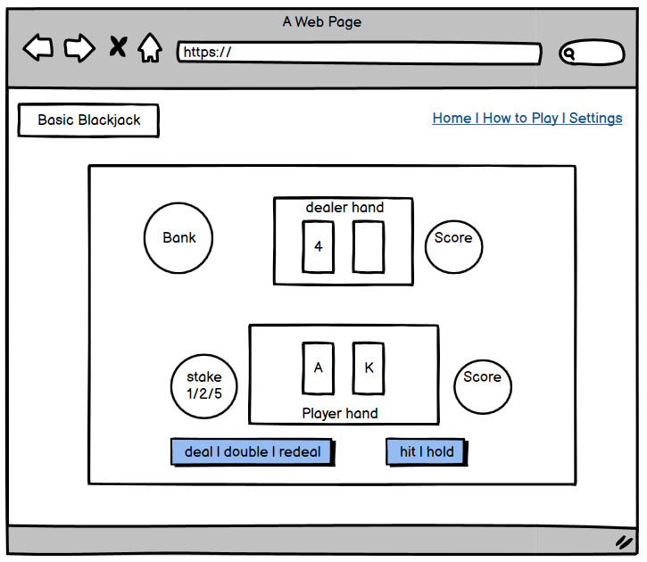
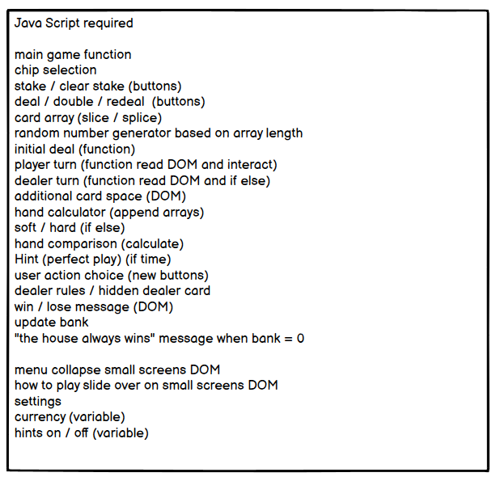

## Features
### Existing Features
- Header
    - The header bar features the logo on the left hand side and the How To Play button on the right. When the logo is clicked this reloads the page. when the user hovers over the how to play button, the background turns white amd the text turns black to alert the user that it is a clickable button. On clicking the button, the rules of the game are displayed to inform the user how to play. 
- Rules overlay
    - The rules overlay is displayed at the discretion of the user, it can be accessed at any time and does not effect gameplay.  It describes the objective of the game and what the user must do to play through the different phases of the game.
    At the end of the text is the close button. When the user hovers over it the button reacts in the same way as the How To Play button in the header for consistency and usability. When clicked, it closes the rules overlay so the user can continue on their gameplay.
    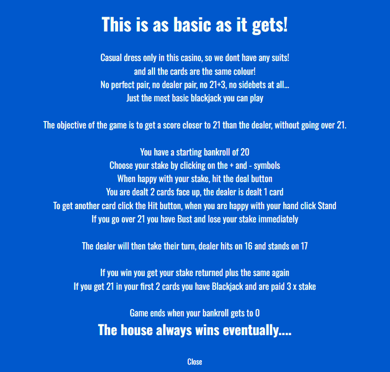
- Gameboard

    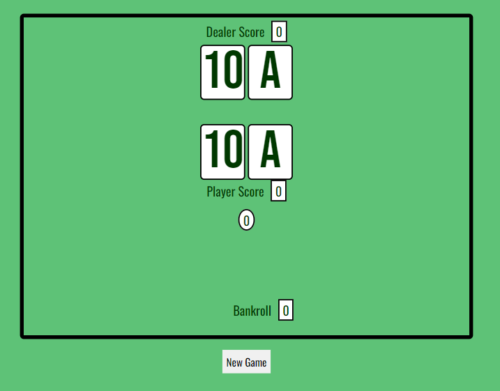
- Staking game phase

    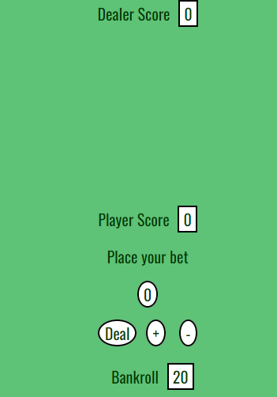
    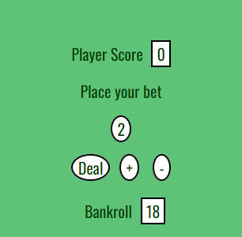
- Player warning alerts

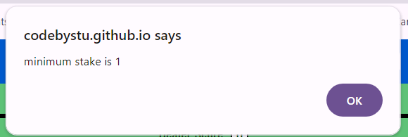
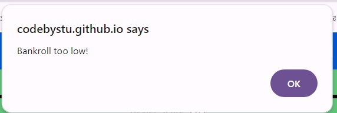
- Initial deal screen

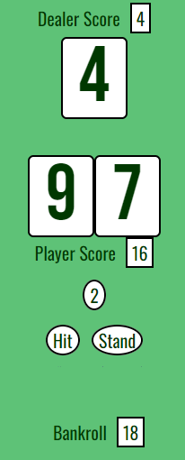

- Gameplay

https://github.com/user-attachments/assets/606d7e39-f08d-4086-b4ec-5b8b30bc827d

- After hand information

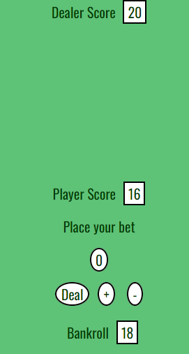

- Custom 404 page
    - This feature gives an error message on a page styled in the theme of the rest of the site, with a link to get the user back to the main landing page. Useful to users who follow a broken link or if they encounter some other error, they can get back to the main site easily.
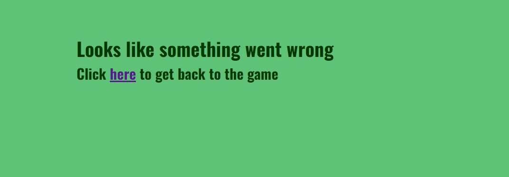
### Features Left To Implement
-   _Future features_
 
## Tools and Technologies Used
- [Balsamiq](https://balsamiq.com/) used for wireframe
- [Git](https://git-scm.com/) for version control
- [Github](https://github.com/) for repository and page deployment
- [Gitpod](https://www.gitpod.io/) the IDE I was originally using but was found to be unreliable
- [VScode](https://code.visualstudio.com/) my IDE of choice now
- HTML language used to place the content
- CSS  language used to style the content
- Markdown  language used to create the README.md and TESTING.md files
- [Bootstrap](https://getbootstrap.com/) used to fix the header to the top of the page
- [Fontawesome](https://fontawesome.com/) for the social media icons
- [Google Fonts](https://fonts.google.com/) for font pairings and importing to project
- [Google Devtools](https://developer.chrome.com/docs/devtools) for testing and development
## Testing
 Testing documentation can be found on the following link

## Deployment

- The site was deployed to GitHub pages. The steps to deploy this static html site were: 
  - In the GitHub repository, navigate to the Settings tab 
  - From the code and automation menu on the left hand column select Pages
  - From the source drop down menu select GitHub Actions
  - Click the "browse all workflows" link
  - Scroll down to the Pages heading and click on the Configure button in the Static HTML box
  - Click the green coloured Commit changes button in the top right corner of the window
  - A pop up will appear with a pre filled commit message of "Create static.yml" an additional text box is available to add an optional extended description. Select "Commit directly to the main branch" from the radio buttons (this is default option) and click the green "Commit changes" button.
  - You are redirected to the workflow page of the repository which shows the last commit with the .yml file added.
  - Navigate back to the repository and you will see a deployment section in the right hand menu below Packages.
  - This will have a status of queued if deployment is still in progress. Once the site is deployed there will be a green tick and a link to the repository deployments section. The link in the top box will show the url for your deployed site. Below is a list of all deployments.
 
## Credits
### Media

### Content

### Code (All highlighted within HTML and CSS code, using notes above the relevant sections)

#### Acknowledgements
- All in the UCP-15 tutor group for making it an enjoyable experience so far and being a soundboard
- Sheryl Goldberg my mentor, your positivity, encouragement and feedback have pulled me through the lowest of days with imposter syndrome
